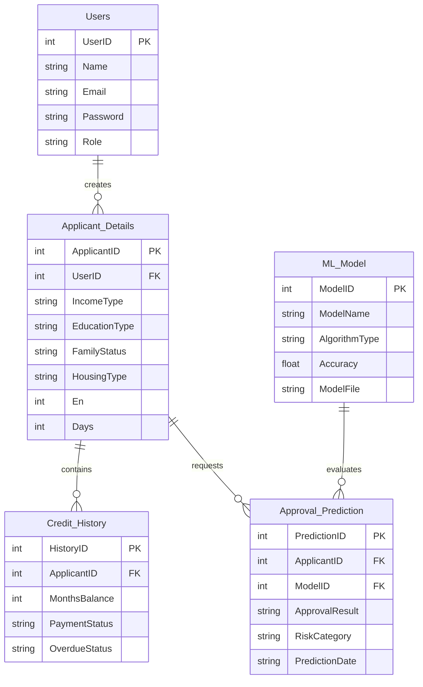

# CredAI Pulse: Smart Credit Card Approval & Risk Prediction System

CredAI Pulse is an end-to-end machine learning system designed to automate credit card applicant screening and risk profiling. Built with a Flask web dashboard, the system is backed by a local SQLite relational database that implements a multi-tier banking schema to track users, applicant profiles, payment history records, and prediction decisions in real-time.

---

## 📂 Project Architecture

```text
├── data/                         # Dataset directory
│   ├── application_record.csv    # Applicant financial and demographic profiles (Kaggle)
│   ├── credit_record.csv         # Monthly credit payment history records (Kaggle)
│
├── models/                       # Trained models and serialized configurations
│   ├── label_encoders.pkl        # Encoders for categorical fields
│   ├── best_model.pkl            # Optimal trained classifier
│   ├── model.pkl                 # Active production model
│   └── evaluation_results.json   # Model evaluation metrics JSON
│
├── static/                       # Static web resources
│   ├── css/
│   │   └── styles.css            # Custom CSS configurations
│   └── images/                   # Pre-generated distribution and evaluation plots
│       ├── class_distribution.png
│       ├── confusion_matrices.png
│       ├── correlation_heatmap.png
│       ├── education_distribution.png
│       ├── family_distribution.png
│       ├── feature_importance.png
│       ├── income_distribution.png
│       ├── occupation_distribution.png
│       └── roc_curves.png
│
├── templates/                    # Jinja2 Flask web page templates
│   ├── home.html                 # System dashboard overview & portal entrance
│   ├── index.html                # Structured multi-field eligibility checking form
│   └── result.html               # Real-time scoring result screen
│
├── src/                          # Machine Learning pipeline source modules
│   ├── data_preprocessing.py     # Statistics, EDA plots, cleaning, merging & label encoding
│   └── train.py                  # Model training, comparison & performance plot generator
│
├── app.py                        # Web app entrypoint (Flask server)
├── database.py                   # Relational database manager (SQLite setup & prediction logger)
├── requirements.txt              # Required dependencies
└── README.md                     # Project documentation
```

---

## 🗄️ Database Schema (ER Diagram Alignment)

The system automatically initializes and populates a local SQLite database (`credit_card_prediction.db`) matching standard financial operations:



---

## 📊 Models Trained & Evaluated

The system trains and compares four distinct classification algorithms:
1. **Logistic Regression**: High-performance linear classifier.
2. **Decision Tree**: Rule-based hierarchical condition model.
3. **Random Forest**: Ensemble bagging classifier reducing variance.
4. **XGBoost**: Gradient boosted decision trees for state-of-the-art accuracy.

Evaluation plots (Confusion Matrices, ROC Curves, and Feature Importance) are generated during training and saved to the `static/images/` directory.

---

## 🛠️ Installation & Setup

### 1. Prerequisites
- **Python 3.10+**
- **pip** (Python package installer)

### 2. Install Dependencies
Run the command below to install Flask, Pandas, NumPy, Scikit-Learn, XGBoost, Matplotlib, Seaborn, and Joblib:
```bash
pip install -r requirements.txt
```

### 3. Place Datasets
Download the datasets from [Kaggle: Credit Card Approval Prediction](https://www.kaggle.com/datasets/rikdifos/credit-card-approval-prediction). Place the two CSV files in the `data/` folder:
- `data/application_record.csv`
- `data/credit_record.csv`

---

## 🚀 Execution Steps

### Step 1: Preprocessing & Exploratory Data Analysis
Cleans negative values, drops duplicates, groups credit record history, merges the two files, applies label encoding, and generates distribution plots:
```bash
python src/data_preprocessing.py
```

### Step 2: Model Training & Selection
Trains the 4 classifiers, evaluates them, selects the best model, and saves it to `model.pkl`:
```bash
python src/train.py
```

### Step 3: Run Flask Web Server
Start the local server:
```bash
python app.py
```
Open a browser and navigate to `http://127.0.0.1:5000/`.

---

## 🔒 Form Validation & Input Safety
- **Direct Variable Mapping**: User inputs from the form are converted to encoded numerical values before passing to the model, avoiding prediction mismatch errors.
- **Relational Logging**: Each prediction runs a secure SQLite transaction to log details and outcomes into `Applicant_Details`, `Credit_History`, and `Approval_Prediction` tables.
